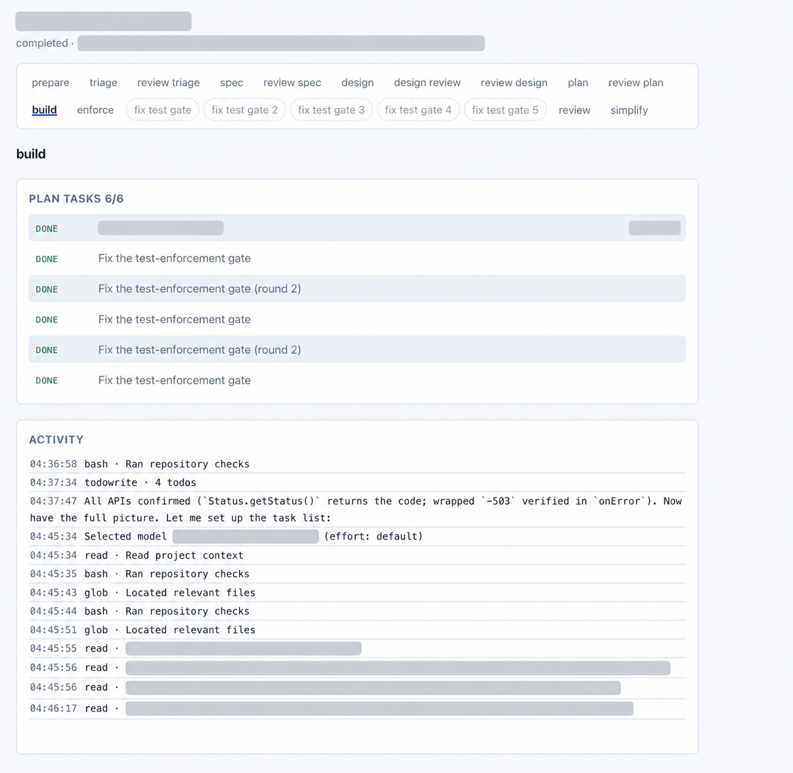

# dev-workflow-agent

Example product built on [`agent-core`](https://github.com/comain/agent-core).
Triage decides which path a task takes; the document stages are gated on a
human; the build stages are not. The Python package is `dev_flow_agent`.



## Quick start

```bash
python3 -m venv .venv
.venv/bin/pip install -e ".[dev]" -e "../agent-core[langgraph,api,yaml]"
export DFA_DATA_DIR="$PWD/var"
mkdir -p "$DFA_DATA_DIR"
.venv/bin/python -m dev_flow_agent dev --host 127.0.0.1 --port 8080
```

Open http://127.0.0.1:8080. Submit a title, request, repo path or URL, and branch.
The worker writes `intent.md`, releases its slot, and waits. Approve or request
changes on the task page; rejecting loops that stage back to its own prompt.
Each approval starts the next document — spec, then design, then plan — and the
run completes when the plan is approved. The design is critiqued before anyone is
asked to approve it, and that critique is shown at the gate.

## Prompts

The agent runs with no skills installed, so each prompt carries its own rubric
rather than telling the agent to go and read one. Those rubrics are incorporated
from `dev-skills` — `spec-driven-development`, `design-driven-development`,
`design-review`, `planning-and-task-breakdown` — and each template cites its
source in a Jinja comment. When a skill changes, update the template that quotes
it; a test fails any prompt that delegates to a skill instead.

## issue-tracker overlay

A task whose branch carries a Jira key — `TICKET-100-20260910` — is issue-tracked feature
work, and the prompts carry the issue-tracker overlay: the `doc/<kind>-<JIRA>.md`
document set with `N/A` rather than absence, the `$jira-$date` branch and
`<JIRA>-SNAPSHOT` version conventions, and mandatory test enforcement with its Java
and mutation specifics. The review
gains a compliance axis that asks for that evidence and treats its absence as a
finding.

Release approval and the RDC `rdcDeployAllowed` flag are deliberately
out of scope here: they gate shipping, not merging, and a branch under review
legitimately has neither. A ship stage will own them; until it exists the
prompts name them only to rule them out, so no stage invents the check.

Documentation is folded into the phases that make it necessary rather than
given stages of its own: design writes `doc/usage-<JIRA>.md` alongside the
design and it is published in the same commit, the plan puts each document
update inside the task that causes it, and a build task updates the document it
makes stale in the same commit as the change. A branch with no Jira key gets none of it — the skill is explicit that
non-Jira work should not be given Jira paperwork.

## Unattended stages

Once the plan is approved the pipeline writes code without asking. The plan's
tasks become a tree the task page shows, each task is one commit pushed to the
branch, and a five-axis review runs over the result. A Critical finding sends
the code back for a fix pass and re-review, up to three rounds; only then does
a gate open. A task that fails twice stops the same way. Everything else —
Important and Nice-to-have findings included — is recorded in `review.md` and
the run continues, finishing with a behaviour-preserving simplification pass.

## Published documents

An approved document is committed to the task's branch as
`doc/<kind>-<JIRA>.md` — the key comes from the branch name, falling back to the
task id — so the spec and design of a change sit beside the change. Only
approved documents are published, and a path guard refuses to carry anything
but `doc/*.md`, so a turn that edited source cannot publish it this way.

## Triage

The first stage classifies the request and a human confirms it, because the
classification decides how much scrutiny the change receives:

| Kind | Path |
| --- | --- |
| `feature-dev` | triage → intent → spec → design → critique → plan → build → review → simplify |
| `bug-fix`, `cr-fix` | triage → intent → spec → build → review → simplify |

Lean work skips design and planning: it arrives already concrete — a defect, or
a reviewer's finding — and four turns spent describing a null check cost more
than the fix. A build with no plan still gets one unit of work, so the loop has
something to do.

Review depth is decided separately, from the diff rather than the kind, with
thresholds ported from `cragent`'s `classify_risk`: a small local change gets
one reader, a sensitive path summons its specialist whatever the size, and a
sprawling diff gets the full panel. A bug fix that turns out to touch forty
files is still reviewed as one.

## Stages

The pipeline is `flow.yaml`, and the stage list the UI shows is derived from it
(`workflow/stages.py`), as is the set of documents the API will serve. Adding a
stage is a `persist_doc` node, a gate, two edges, a branch, and a prompt
template — no change to the pages or the allowlist.

## Commands

| Command | What |
|---|---|
| `python -m dev_flow_agent dev --host 127.0.0.1 --port 8080` | UI + API + worker |
| `python -m dev_flow_agent serve --host 127.0.0.1 --port 8080` | UI + API |
| `python -m dev_flow_agent worker` | Daemon only (same `DFA_DATA_DIR`) |
| `pytest -q` | Tests |

`--allow-anonymous-gates` is a demo flag. Every page shows a banner. Do not use off-loopback.

Behind a reverse-proxy path prefix, set `DFA_ROOT_PATH=/dev-flow-agent`.
Beta deploy is a Git pull of `main`; see [remote-deployment.md](remote-deployment.md).

See [docs/usage-dev-workflow-v1.md](docs/usage-dev-workflow-v1.md).
