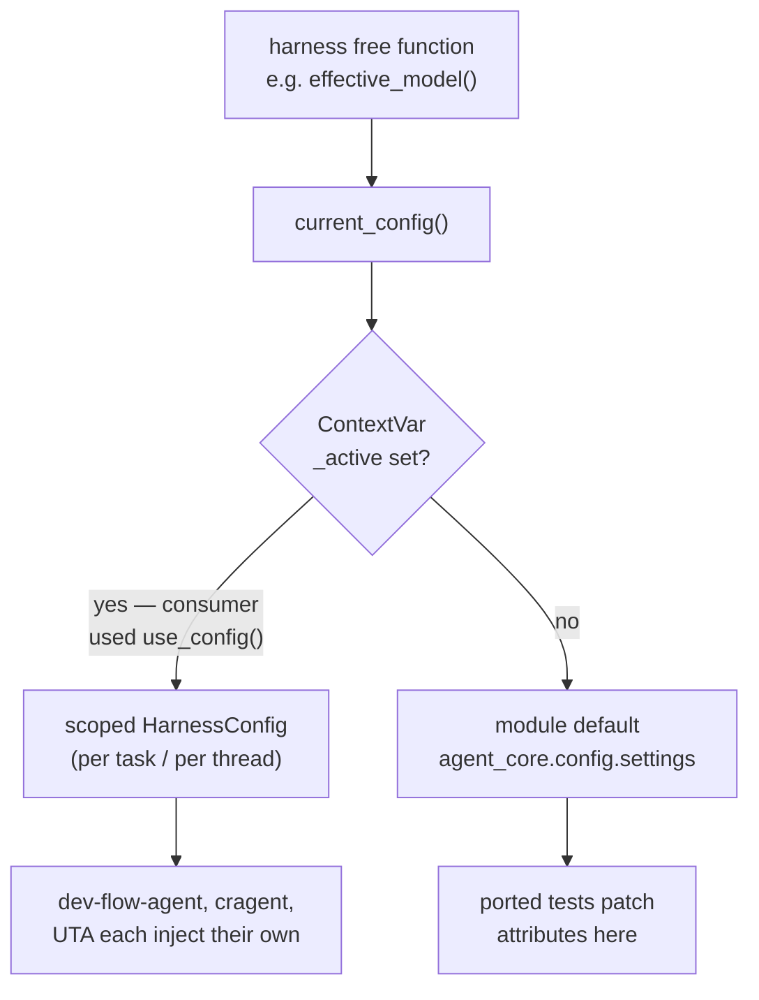

# Design: agent-core — OpenCode Harness Extraction (Task 1)

## Status

**Built 2026-08-06.** 243 tests green in `../agent-core`; deterministic and live
parity both pass. All acceptance criteria met. See the changelog for what the build changed
about this design.

**Approved 2026-08-06.** Design review's Critical and Important findings were
all dispositioned *fix now* by the human and applied. Cleared for `/plan`.

Standing assumption on the dual-run parity check: it remains a Task 1
acceptance gate, sequenced last so it cannot block the port itself. If provider
access proves unavailable in this environment, that is escalated as a decision
rather than silently downgraded to a Task 8 concern.

Derived from [`spec-agent-core-harness-extraction.md`](spec-agent-core-harness-extraction.md)
(approved 2026-08-06). Single-repo work: the detail design is folded into this
overview, per the design-driven-development guidance.

Source commit of the extraction: to be recorded at implementation start, so
drift against UTA is measurable at Task 8/9 migration time.

## Goals

1. `../agent-core` exists as a standalone installable repo containing the
   OpenCode harness, with no reference to UTA or cragent.
2. Harness behaviour is **bit-for-bit unchanged**, proven by UTA's own 11 test
   files (3,370 LOC) running green against the ported code.
3. Configuration is injectable, with no deployment-specific values baked in.
4. The migration cost of Tasks 8 and 9 is kept low.

## Non-Goals

- Migrating any consumer (Tasks 8, 9).
- Task/runtime layer (Task 1b), identity (3), SSE (4), gates (5), images (6).
- Any harness improvement. A port only.

## The central design problem

The spec assumed "inject config" was a small change. It is not, and the shape
of the harness dictates the entire design.

**Evidence gathered 2026-08-06:**

- **99 read sites** across 5 modules: 96 dot-access (`client.py` 17,
  `config.py` 24, `process.py` 22, `server.py` 17, `tiered_router.py` 16) plus
  **3 dynamic `getattr(settings, ...)` sites** at `process.py:193,222,358`.
  *(The 3 getattr sites were missed in the first count — design review finding
  C3. They matter disproportionately: a `settings.` → `current_config().`
  substitution does not match `getattr(settings, ...)`, so a purely mechanical
  pass would silently leave them reading a stale global.)*
- All 99 are **reads**; nothing in the harness mutates settings.
- They sit inside **module-level free functions** that take no config
  parameter — `generate_opencode_config()`, `effective_model()`,
  `parse_provider_chain()`, `provider_api_key()`. Config arrives via the
  imported global `from uta.config import settings`.
- The tests patch that global **by dotted string**:
  `monkeypatch.setattr("uta.config.settings.opencode_model", "gpt-5")`.
  There are ~250 such lines across the 11 harness test files.

The consequence is decisive. Threading a `HarnessConfig` parameter through
every free function would change ~96 call sites *and* invalidate ~250 test
lines, because those tests would no longer have a global to patch. The spec
makes the ported tests the correctness oracle (F4) and forbids behavioural
change to make them pass. **A refactor that rewrites the oracle destroys it.**

So the design must deliver injectability *without* changing function
signatures or the tests' patching idiom.

## Decision: context-scoped config with a mutable module default

We will resolve configuration through an accessor backed by a `ContextVar`,
whose default is a mutable module-level instance.

```python
# agent_core/config.py
class HarnessConfig(BaseSettings):
    model_config = SettingsConfigDict(env_prefix="AGENT_", extra="ignore")
    opencode_model: str = "token-pool/gpt-5.5"
    ...                      # flat, all 39 fields the harness reads

settings = HarnessConfig()                       # module default, mutable
_active: ContextVar[HarnessConfig | None] = ContextVar("_active", default=None)

def current_config() -> HarnessConfig:
    return _active.get() or settings

@contextmanager
def use_config(cfg: HarnessConfig):               # consumer injection point
    token = _active.set(cfg)
    try: yield cfg
    finally: _active.reset(token)
```

Every harness read site becomes `current_config().X` instead of `settings.X`.



### Why this and not the alternatives

| Option | Verdict |
|---|---|
| **Context-scoped accessor + mutable default** | **Chosen.** Port is mechanical on both sides. Real consumers get isolation. Tests keep their idiom. |
| Thread `HarnessConfig` through every signature | Rejected. ~96 signature changes, invalidates ~250 test lines, destroys the oracle, and maximises Task 8/9 migration cost. Purest design, wrong trade for a port. |
| Plain mutable global (`agent_core.config.settings` only) | Rejected. Simplest and would pass the tests, but re-homes the exact global that blocks per-task provider config — and cragent already runs concurrent reviewers. We would pay to remove it in Task 1b. |
| Class-based `Harness` object holding config | Rejected for now. Cleanest long-term, but converts free functions to methods — same oracle-destroying diff as threading, with more churn. Reconsider at Task 1b when the call sites move anyway. |

Recorded as [ADR-002](decisions/ADR-002-harness-config-injection.md).

### What this makes mechanical

| Change | Scale | Nature |
|---|---|---|
| `settings.X` → `current_config().X` | 96 sites | Mechanical, reviewable as one diff |
| `getattr(settings, "X", d)` → `getattr(current_config(), "X", d)` | 3 sites | **Separate pass, separate grep.** Not covered by the rule above |
| `"uta.config.settings.X"` → `"agent_core.config.settings.X"` | ~250 test lines | Pure string substitution |
| `from uta.opencode.Y import` → `from agent_core.harness.Y import` | all files | Pure string substitution |

Verification is by grep (spec AC3, AC4), which is why the acceptance criteria
are written as greps. **A residual `grep -n "settings" src/agent_core/harness/`
must return only `current_config()` call sites** — this catches the getattr
class of miss, which the narrower substitution grep does not.

### Decision: the undeclared `opencode_prompt_file_threshold_chars` field

`process.py:193` reads
`int(getattr(settings, "opencode_prompt_file_threshold_chars", 0) or 60000)`.
This field is **not declared** in `uta/config.py`. Because UTA's settings model
uses `extra="ignore"`, setting `UTA_OPENCODE_PROMPT_FILE_THRESHOLD_CHARS` in
the environment today does nothing — the `getattr` always falls through to the
literal 60000. The knob is dead.

If `HarnessConfig` declares the field, the environment variable silently starts
working. **No ported test would detect this**, because no test exercises a knob
that has never functioned. That is precisely the class of change the
port-defect rule exists to prevent.

**We will not declare the field.** The `getattr` with its literal default is
ported verbatim, preserving the dead knob exactly as it behaves today. Making
it live is a behaviour change, and behaviour changes are out of scope for a
port (spec: "This is a port, not an improvement").

Recorded in the deviations table as a *deliberate non-change*, and raised as a
follow-up: UTA should either declare the field or delete the dead read. That is
a UTA bug, fixed in UTA, not here.<sup>Alternative considered: declare the
field and document the behaviour change. Rejected — it trades a silent
improvement for the loss of the parity guarantee that justifies the whole
port.</sup>

## Public interface

**Derivation method (corrected after design review, finding C1):** the surface
is derived from **every production call site in UTA**, cross-checked against
each module's declared public symbols — *not* from what the tests happen to
import. The first attempt used the test imports and missed 10 symbols,
including two of the three public symbols in `fallback.py`, both of which are
used by UTA production code.

Call sites enumerated: `uta/cli.py`, `uta/graph/nodes.py`,
`uta/tasks/manager.py`, `uta/engine/project_summary_artifacts.py`,
`uta/language/python/batch.py`, plus intra-package use in `uta/opencode/`.

`agent_core.harness.__init__` exports:

| Module | Symbols |
|---|---|
| `client` | `OpenCodeClient`, `OpenCodeAuthClient` |
| `process` | `OpenCodeProcess`, `TurnResult`, `classify_provider_model_error` |
| `server` | `OpenCodeServer` |
| `stream` | `OpenCodeStreamParser` |
| `config` | `generate_opencode_config`, `CURSOR_PLUGIN_NAME`, `EXTERNAL_DIRS_CONFIG`, `GLOBAL_OPENCODE_CONFIG`, `GLOBAL_OPENCODE_PLUGIN_ROOT`, `OPENCODE_PLUGIN_CACHE_ROOT` |
| `tiered_router` | `ProviderCandidate`, `ModelHealthTracker`, `effective_model`, `cheap_model_for_phase`, `provider_candidates`, `available_provider_candidates`, `opencode_model_id`, `provider_local_model_id`, `provider_token_statuses`, `mark_model_unhealthy`, `model_health_for_candidates`, `reset_model_availability_cache`, `parse_provider_chain`, `parse_provider_tokens`, `parse_provider_base_urls`, `parse_model_list_response` |
| `fallback` | `ProviderRateLimitError`, `raise_for_provider_fallback_event`, `poll_completion_with_task_guard` |
| `rate_limit` | `opencode_log_dir`, `debug_log_dir`, `recent_log_files`, `parse_rate_limit_payload`, `detect_rate_limit_in_logs` |
| `net` | `format_host_for_url`, `build_base_url` |

Plus `agent_core.config`: `HarnessConfig`, `settings`, `current_config`,
`use_config`, `propagate`.

`PROJECT_ROOT` is deliberately **not** exported — see the layout hazard below.

**Note:** `tests/test_opencode_process.py` imports the private `_build_env`
from `uta.opencode.process`. It stays private and is **not** re-exported; the
ported test imports it from the module directly. Tests are permitted to reach
into internals; consumers are not.

## Configurable env prefix

`uta/config.py:6` hard-codes `env_prefix="UTA_"`. agent-core defaults to
`AGENT_`, and a consumer selects its own:

```python
class CrHarnessConfig(HarnessConfig):
    model_config = SettingsConfigDict(env_prefix="CR_", extra="ignore")
```

Subclassing is the documented path. pydantic-settings v2 also accepts an
`_env_prefix` constructor kwarg; **this must be verified against the pinned
version during implementation** rather than assumed, and the subclass path is
the fallback if it does not behave as expected.

## Domain leaks to neutralise

| Leak | UTA form | agent-core form | Notes |
|---|---|---|---|
| `index_source_dirs` | default `~/wms/api,~/bach/api,~/tms/api,~/finance/api,~/md/api` | default `""`, **name retained** | Read at `config.py:221` (`opencode_external_dirs or index_source_dirs`). `tests/test_opencode_config.py:491` patches it explicitly, so the default change is safe for the oracle. **See dual-ownership hazard below.** |
| `opencode_turn_log_dir` | default `.uta_cache/opencode_turns` | default `.agent_cache/opencode_turns` | Consumer-overridable. |
| `uta_debug_log_dir()` | public function at `rate_limit.py:15`, returns `/tmp/uta-run-logs` | renamed `debug_log_dir()`, returns `/tmp/agent-run-logs` | **Found during design review.** A UTA-branded *public function name* and runtime path. Called at `client.py:527`. Renaming is a deliberate, recorded deviation. |
| `PROJECT_ROOT` | `Path(__file__).resolve().parents[2]` at `config.py:36` | must not be depth-derived | **Found during design review — silent-breakage hazard.** Under `uta/opencode/config.py`, `parents[2]` is the repo root. Under `src/agent_core/harness/config.py`, `parents[2]` is `src/`. The expression stays valid Python and changes meaning. Resolve explicitly, do not export, and cover with a test asserting what it points at. |

### Verified (design review)

No ported harness test depends on the *default* of `index_source_dirs` or
`opencode_turn_log_dir` — `test_opencode_config.py:491` patches the former
explicitly, and no harness test references the latter. No oracle conflict.

### Dual-ownership hazard: `index_source_dirs` (review finding I4)

`index_source_dirs` is **not harness-owned**. `uta/cli.py` reads it too
(`tests/test_cli.py:748,800,858` patch `uta.cli.settings.index_source_dirs`).

**Decision:** keep the field in `HarnessConfig` under its existing name — the
harness genuinely reads it, and renaming would force a real edit to a ported
test, weakening the oracle for no Task 1 benefit.

**Recorded as a Task 9 migration requirement:** when UTA migrates, it must
delegate to the harness config rather than keep a second copy of this field.
Two config objects that can disagree about the same value is a bug waiting to
happen, and Task 9 is where it must be closed — not here.

### AC4's grep is insufficient

The spec's AC4 (`grep -rn "wms/api\|bach/api\|\.uta_cache\|UTA_"`) would not
catch `uta-run-logs` or `uta_debug_log_dir`. **AC4 is amended** to a
case-insensitive search for `uta` across `src/agent_core/`, with an explicit
allowlist for any legitimate match. Recorded in the verification plan.

## Failure modes

| Mode | Handling |
|---|---|
| `ContextVar` does not propagate into `ThreadPoolExecutor` workers — a new thread starts with an empty context, so a scoped config silently falls back to the module default | **Real hazard**: cragent fans out reviewers via `ThreadPoolExecutor` (`review_v2/workflow.py`). Provide `agent_core.config.propagate(fn)` wrapping `contextvars.copy_context().run`, document it prominently, and cover it with a test that asserts a scoped config survives an executor hop. |
| Ported test fails | Treated as a port defect. Fix the port. If the failure is a genuine pre-existing UTA bug, report it and fix in UTA separately — never silently during the port. |
| Hidden runtime coupling in `client.py` (deferred imports at `client.py:521,527`) | Port `client.py` and `process.py` first so this surfaces on day one. No fallback path exists (spec decision 4); coupling gets fixed. |
| UTA harness drifts during the port | Record source commit SHA at start; diff before Task 9. |

## Capacity, reliability, security

- **Capacity:** no runtime cost change. `current_config()` is one `ContextVar.get()`
  per read — nanoseconds against subprocess spawns and LLM calls. No new RPC,
  DB, or external call is introduced by this task.
- **Reliability:** unchanged; the harness is behaviourally identical by
  construction, and the ported suite is the gate.
- **Security:** provider API keys (`openai_api_key`, `deepseek_api_key`,
  `tencent_api_key`, `gemini_api_key`, `openrouter_api_key`) move into
  `HarnessConfig`. They must never be logged or serialised into turn logs.
  Add a `__repr__`/`model_dump` redaction test — this is a **new** test, not a
  ported one, justified because moving secrets across a package boundary is a
  new exposure surface.

## Repo structure

```
../agent-core/
  pyproject.toml            # name=agent-core, requires-python>=3.9
  README.md                 # public interface, install, env prefix, executor caveat
  src/agent_core/
    __init__.py
    config.py               # HarnessConfig, settings, current_config, use_config, propagate
    harness/
      __init__.py           # public exports table above
      client.py process.py server.py stream.py
      config.py tiered_router.py fallback.py rate_limit.py net.py
  tests/
    conftest.py             # ported: fixtures_dir + pytest_ignore_collect (12 LOC)
    test_opencode_client.py  test_opencode_client_streaming.py
    test_opencode_config.py  test_opencode_process.py
    test_opencode_server.py  test_opencode_server_removal.py
    test_opencode_stream.py  test_parse_providers.py
    test_tiered_routing.py   test_tiered_routing_resilience.py
    test_context_providers.py
    test_consumer_integration.py   # new: AC6
    test_config_scoping.py         # new: executor propagation + secret redaction
```

`tests/conftest.py` is 12 lines (one `fixtures_dir` fixture and a
`pytest_ignore_collect` hook) and ports directly. Fixture *data* referenced by
`fixtures_dir` must be inventoried during implementation.

## Build sequence

1. Scaffold repo, `pyproject.toml`, `HarnessConfig` with all 39 fields, plus
   `current_config` / `use_config` / `propagate`. Record source commit SHA.
2. Port `net.py`, `fallback.py`, `rate_limit.py` (applying **D1**), `stream.py`
   — the four with zero external imports. Establishes the harness runs at all.
3. Port `client.py`, then `process.py` — **the risk concentration, deliberately
   early.** Includes the 3 `getattr` sites and the C2 non-change.
4. Port `tiered_router.py`, `config.py` (applying **D2**, **D3**), `server.py`.
5. Port all 11 test files; run; drive to green without behavioural change.
6. Add the new tests: consumer integration (AC6), executor propagation, secret
   redaction, `PROJECT_ROOT` resolution.
7. Run the dual-run parity check.
8. Verify AC greps including the widened AC4 and the residual-`settings` grep;
   write README; complete the deviations table.

## Verification plan

| AC | Check |
|---|---|
| 1 | `pip install -e ../agent-core` succeeds |
| 2 | `pytest` green in agent-core, 11 ported files, `--no-skip` audit |
| 3 | `grep -rn "uta\.\|unit_test_agent" src/agent_core/` → empty |
| 4 | `grep -rn "wms/api\|bach/api\|\.uta_cache\|UTA_" src/agent_core/` → empty |
| 5 | `git -C ../unit-test-agent status --porcelain` and cragent unchanged **against the pre-existing baseline** — both repos already carry unrelated local edits from before this task, recorded at implementation start |
| 6 | `test_consumer_integration.py` passes, imports no UTA |
| 7 | README enumerates the export table |
| 8 | Deviation list in this document, or explicitly empty |
| **4 (amended)** | `grep -rni "uta" src/agent_core/` → only allowlisted matches. Replaces the original narrower grep, which missed `uta-run-logs` and `uta_debug_log_dir`. |
| **new** | Residual `grep -n "settings" src/agent_core/harness/` → only `current_config()` sites (catches missed `getattr` reads) |
| **new** | `PROJECT_ROOT` resolution test — asserts it points where intended under the `src/agent_core/harness/` layout, not at `src/` |
| **new** | **Dual-run parity check** — see below |

### Dual-run parity check (review finding I5)

The ported test suite proves the code behaves as its tests expect. It does not
prove the *assembled harness* behaves as UTA's does on a real turn — the tests
stub the model.

**We will run one real OpenCode turn through both harnesses with identical
configuration and diff the emitted event streams.**

- Same prompt, same model, same provider, same repo fixture, temperature
  pinned as far as the provider allows.
- Compare the **structural** event stream — event types, ordering, tool-call
  names, terminal state — not the model's prose, which is not deterministic.
- Any structural difference is a port defect and blocks acceptance.
- Cost: one live model call plus a small repo fixture. Cheap against the
  alternative of discovering divergence in Task 8, in front of cragent's
  production reviewers.

This is the concrete production-proof signal the first-principles check
demanded, and it is the only acceptance criterion that exercises the harness
end to end.

## Deviations from UTA's harness

Any entry requires a reason and is subject to the port-defect rule. Three are
already known from design review; the table is completed during implementation.

Final register as built. D4 and D5 were discovered during implementation and
were not anticipated by this design.

| # | Module | Deviation | Reason |
|---|---|---|---|
| D1 | `rate_limit.py`, `client.py` | `uta_debug_log_dir()` → `debug_log_dir()`; `/tmp/uta-run-logs` → `/tmp/agent-run-logs` | Product-branded public name and runtime path cannot ship in a shared package. Caller at `client.py:527` updated — the deferred import this design flagged as the likely coupling site, which is exactly what it turned out to be. |
| D2 | `config.py` | `PROJECT_ROOT` removed; `EXTERNAL_DIRS_CONFIG` resolves against the consumer's cwd | The depth-derived expression stays valid but changes meaning under the new layout. |
| D3 | `config.py`, `process.py` | Defaults changed: `index_source_dirs` → `""`, cache dir → `.agent_cache` | Deployment-specific values. Verified no ported test depends on either default. |
| **D4** | `config.py` | Credential env aliases `UTA_OPENAI_API_KEY`, `UTA_BASE_URL`, `UTA_BAS_URL` dropped for `AGENT_*` and vendor-standard names | **Not anticipated.** These used `validation_alias`/`alias`, which bypasses `env_prefix` entirely — so the branded names would have survived any prefix change. `UTA_BAS_URL` was a typo-tolerance alias; carrying another product's typo into a shared package is indefensible. |
| **D5** | `config.py`, `process.py` | `AGENT_SERVICE_PYTHON_BIN` emitted *alongside* `UTA_SERVICE_PYTHON_BIN`; cache dir became the `agent_cache_dir` field | **Not anticipated, human-ratified.** These are cross-repo contracts, not internal names: `uta/language/python/verification/runner.py:3056` reads the env var and 63 sites read `.uta_cache`. Renaming outright would silently break UTA's Python verification at Task 9. Compatibility window instead; legacy names drop once consumers migrate. |
| — | `process.py` | **Deliberate non-change:** `opencode_prompt_file_threshold_chars` stays undeclared | Declaring it would silently activate a currently-dead env knob. |

### Also changed, outside the harness modules

`populate_by_name=True` on `HarnessConfig`. Not a harness deviation — the config
layer has no counterpart in the source — but required: fields carrying an
`alias` cannot be populated by field name without it, so
`HarnessConfig(openai_api_key=...)` silently yielded `None`. The source never
hit this because it loaded from the environment exclusively; constructing
configuration in code is the entire point of this package.

## Rollout and rollback

Rollout is trivial: a new repo with no consumers. Nothing in production changes
until Task 8. Rollback is deleting the repo.

The real rollout risk lands at Task 8 (cragent migration), not here. This
design lowers it deliberately — unchanged function signatures mean cragent's
migration is an import rewrite plus one `use_config()` call, not a refactor.

## Resolved questions

1. **Default env prefix is `AGENT_`.** agent-core ships a working default;
   consumers override by subclassing. Requiring every consumer to subclass adds
   ceremony without preventing any error we can name.
2. **`current_config()` returns the module default silently** rather than
   raising when nothing is scoped. Raising is safer, but it breaks the ported
   tests' patching idiom and therefore the oracle. Revisit as Task 1b
   hardening, once the call sites are being touched anyway.
3. `run_error_classifier.py` placement — deferred to Task 1b (spec Q3).

## Design review

Conducted 2026-08-06 against the `design-review` rubric. All claims were
verified against the source rather than accepted from the design; three claims
in the first draft were wrong.

| # | Axis | Severity | Finding | Disposition |
|---|---|---|---|---|
| C1 | API completeness | Critical | Public interface derived from test imports, not production call sites; 10 symbols missing, including 2 of 3 in `fallback.py` used by `uta/graph/nodes.py` and `uta/language/python/batch.py` | **Fixed** — re-derived from all call sites; derivation method recorded |
| C2 | Risk / compatibility | Critical | `opencode_prompt_file_threshold_chars` is undeclared; declaring it would silently activate a dead env knob, undetectable by any ported test | **Fixed** — will not declare; recorded as deliberate non-change |
| C3 | Verification | Critical | "96 read sites, mechanical substitution" false — 3 `getattr(settings, ...)` sites are not matched by the substitution | **Fixed** — count corrected to 99, separate pass and residual grep added |
| I4 | Abstraction / ownership | Important | `index_source_dirs` also read by `uta/cli.py`; belongs to two owners | **Fixed** — retained in `HarnessConfig`, dual-ownership recorded as a Task 9 requirement |
| I5 | Verification depth | Important | No production-proof signal; plan was tests plus greps | **Fixed** — dual-run parity check added |
| N6 | Decisiveness | Nice-to-have | Open questions 1–2 unresolved | **Fixed** — both decided above |
| N7 | Structure | Nice-to-have | No changelog | **Fixed** — added |

Two further hazards were found while applying the fixes, neither present in the
first draft and neither catchable by the original acceptance criteria:
`uta_debug_log_dir()`'s branded name and path (D1), and `PROJECT_ROOT`'s
depth-derived expression silently changing meaning under the new layout (D2).
AC4's grep was widened in response.

### First-principles answers

1. **Goal:** one shared OpenCode harness instead of three divergent copies.
2. **Simplest right solution?** Yes, with one accepted concession — `ContextVar`
   is machinery Task 1 does not strictly need (a mutable global would pass every
   test). Kept because retrofitting it later means touching 99 sites twice and
   cragent's concurrent reviewer fanout will require it at Task 8 regardless.
3. **Production proof:** the dual-run parity check.
4. **Worst case:** agent-core diverges silently and Task 8 ships a subtly
   different reviewer to production. Guards: the ported oracle, the strict
   port-defect rule, and the parity check. Blast radius at Task 1 is zero —
   nothing consumes the package yet.

## Changelog

| Date | Change |
|---|---|
| 2026-08-06 | Initial draft |
| 2026-08-06 | Design review applied: C1–C3, I4–I5, N6–N7 fixed; deviations D1–D3 recorded; AC4 widened |
| 2026-08-06 | **Built.** ADR-002's rewrite mechanism replaced by a config proxy (ADR-002 superseded, human-ratified). D4 and D5 added — neither anticipated here. Test oracle corrected from 11 files to 8: three had zero harness imports. Live parity initially blocked by an unreachable endpoint, then completed the same day; see `agent-core/docs/parity.md`. |
