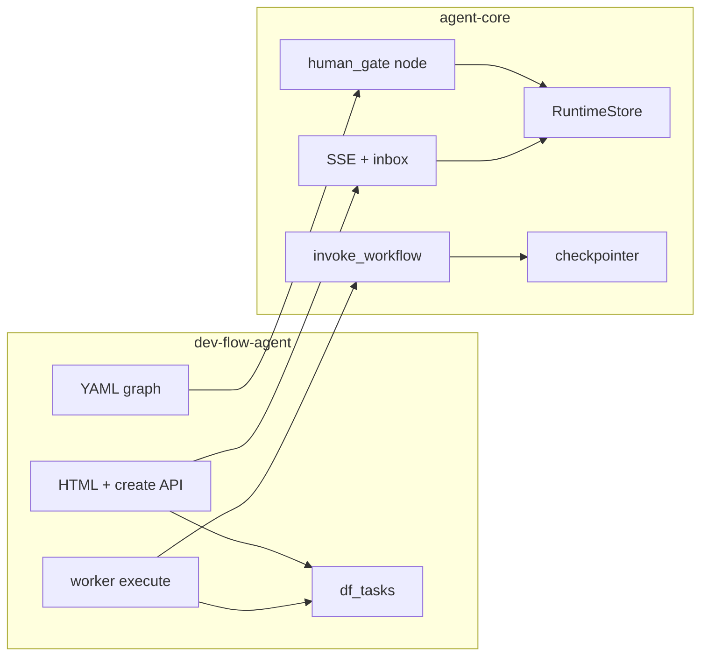

# Design Overview: dev-flow-agent v1

Derived from [`spec-dev-workflow-v1.md`](spec-dev-workflow-v1.md)
(approved 2026-09-09). Two-repo work. Detail:

- [`design-dev-workflow-v1-agent-core.md`](design-dev-workflow-v1-agent-core.md)
- [`design-dev-workflow-v1-dev-flow-agent.md`](design-dev-workflow-v1-dev-flow-agent.md)

Usage: [`usage-dev-workflow-v1.md`](usage-dev-workflow-v1.md).

## Goals And Non-Goals

**Goals**

1. Close the agent-core human-gate seam so a YAML workflow can suspend,
   release its worker, and resume under a lease after a human answers.
2. Ship the fourth consumer: create a task from web or API, write `intent.md`,
   gate, write `spec.md`, gate, survive a worker restart.
3. Give a human one task page that shows pipeline, live redacted progress,
   the current artifact, and the gate form.

**Non-goals** (spec Out of scope): plan/build/ship nodes, skill router, image
input, committing artifacts to the target repo, migrating UTA/CR/spec-gen,
React/chat UIs, anonymous gate answers.

## High-Level Design

Two processes, two stores, one browser.

```
Browser / HTTP client
        │
        ▼
   FastAPI app (dev-flow-agent)
        │  mounts agent_core.api.create_task_router
        │  adds POST /api/v1/tasks, GET /api/v1/tasks/{id}/artifacts/{name}, HTML pages
        │
        ├──── RuntimeStore (gates, events, heartbeats)
        ├──── SecureArtifactStore (intent.md / spec.md copies)
        └──── df_tasks SQLite (product queue)

   TaskDaemon worker (same host; same DBs)
        │  claim → invoke_workflow → SUSPENDED | COMPLETED | FAILED
        │
        ├──── LangGraph checkpointer (graph position + interrupts)
        ├──── GitWorkspace (target repo checkout)
        └──── OpenCode harness (write_intent / write_spec turns)
```

Agent-core owns interrupt, gate rows, SSE, identity, artifacts, shared nodes.
The product owns the queue, the YAML graph, prompts, HTML, and create-task.

## Intra-System Relationships And Cooperation

| Piece | Owner | Contract |
|---|---|---|
| `human_gate` node + `gate_decision` selector | agent-core | YAML `uses: human_gate` |
| `invoke_workflow` dispositions | agent-core | fifth value `suspended`; optional `resume_value` |
| `RuntimeStore.answer_gate` | agent-core | write only; does not run the graph |
| `TaskDaemon` | agent-core | already maps `TaskOutcome.SUSPENDED` |
| Task rows, claim SQL | product | `queued` / `running` / `waiting_human` / `completed` / `failed` |
| SSE `/api/v1/tasks/{id}/events` | agent-core router | product mounts it |
| Inbox `/gates` | agent-core router | markdown via reserved prompt key |
| HTML `/`, `/tasks/{id}` | product | Jinja + EventSource |
| Skill files | `../plugins/plugins/dev-skills` | read-only prompt source |



## Data Dependency Flow

1. **Create:** HTTP body `{title, request, repo_url, branch}` + principal →
   `df_tasks` row (`queued`) + idempotency row. No model call.
2. **write_intent:** `request` + interview-me skill + repo tree → model →
   `intent.md` bytes. Written to `SecureArtifactStore` namespace
   `{task_id}/intent.md` (immutable per attempt file `intent-{n}.md`, plus
   mutable `intent.md` pointer of the latest). Copied into graph state as
   `intent_md` (text only).
3. **review_intent:** `intent_md` → gate prompt `artifact_markdown` → inbox /
   task page. Human response `{decision, comments}` → graph state.
4. **write_spec:** accepted `intent_md` + comments + spec-driven-development
   skill + repo tree → `spec.md`, same store shape.
5. **review_spec:** same as (3) for `spec_md`.
6. **Progress:** harness tool events → `HarnessEventBridge` → `ac_task_events`
   (`agent_progress`) → SSE. Not product truth.
7. **Graph position:** LangGraph checkpointer only. Task `status` is product
   truth.

Lineage: originator text is in `df_tasks.request` (never overwritten). Agent
prose is only in the artifact store. Gate answers are in `ac_human_gates`.

## Key Process Flow (inter-repo / end-to-end)

```mermaid
sequenceDiagram
  actor H as Human
  participant API as serve
  participant DB as df_tasks
  participant D as worker
  participant IW as invoke_workflow
  participant M as model
  participant G as RuntimeStore

  H->>API: POST /api/v1/tasks
  API->>DB: insert queued
  D->>DB: claim (lease)
  D->>IW: start
  IW->>M: write_intent
  IW->>G: open_gate review_intent
  IW-->>D: suspended
  D->>DB: status=waiting_human, release lease
  Note over D: process may exit
  H->>API: GET /tasks/{id} (SSE + artifact)
  H->>API: POST /gates/{id}/answer
  API->>G: answer_gate
  D->>DB: claim (waiting_human with answered gate, exclusive lease)
  D->>IW: resume_value=gate.response (interrupt + response; not resumed_at)
  IW->>M: write_spec
  IW->>G: open_gate review_spec
  IW-->>D: suspended
  H->>API: approve spec
  D->>IW: resume_value
  IW-->>D: resumed, next empty
  D->>DB: completed
```

Reject at either gate: selector `gate_decision` returns `reject` → writer node
again with `comments` in state and `attempt` incremented → new gate id.

## Key Design Tradeoffs

1. **Leased resume, not maintenance invoke.** [ADR-005](decisions/ADR-005-leased-gate-resume.md).
   Also considered keeping `resume_answered_gates` as the driver; rejected
   because continuation is paid work and must hold a lease.
2. **Additive agent-core 0.8.x, not 0.9.** Existing consumers never interrupt.
   A breaking bump would force UTA/CR pin churn for a path they do not use.
   Also considered a product-side wrapper around `Command`; rejected as
   wrong-module.
3. **Server-rendered HTML, no SPA.** Spec UI decision. Also considered React
   and HTMX; rejected — three pages, SSE already exists, siblings have no
   node build.
4. **`artifact_markdown` is a reserved key on the gate prompt**, not a new
   column. Inbox already JSON-serialises `prompt`. Adding a column is a
   schema migration four products inherit; a reserved key is a rendering
   convention. Also considered a sibling `artifact_relpath` column; deferred
   until a second product needs indexed artifact queries.
5. **One compiled graph per process, `task_ref` in state.** Context holds
   `runtime_store`, `artifacts`, `workspace`, `runner`, `prompts`. Binding
   `task_ref` into context would force a compile per task.
6. **Two commands (`serve`, `worker`) plus `dev` that runs both.** Local
   default is `dev` (API thread + daemon thread). Production-like is two
   processes on the same SQLite files (SQLite is the v1 store; we do not
   introduce Postgres). Also considered API-only with in-request execution;
   rejected — a request cannot outlive a gate.
7. **Latest artifact is a mutable `intent.md` / `spec.md`; each attempt is
   immutable `intent-{n}.md`.** UI always reads the latest name. Attempts
   remain evidence. Also considered only immutable names; rejected because
   the task page URL would need the attempt number.

## Capacity, Reliability, And Security

**Capacity (v1, single operator / small team)**

| Call | Volume | Cost | Budget |
|---|---|---|---|
| `POST /api/v1/tasks` | humans, << 1/s | 1 indexed insert | unique on `idempotency_key` |
| `GET /` list | page load / 10s poll | 1 query `ORDER BY updated_at DESC LIMIT 50` | index `updated_at` |
| SSE | 1 EventSource per open task page | `events_since(after_id)` incremental | existing agent-core poll; keepalive comments |
| Artifact GET | per page load / after gate | 1 bounded read, max 1 MiB | `SecureArtifactStore` already requires max bytes |
| Claim | daemon tick ~5s | 1 SQL | lease columns indexed |
| Model turn | 2 per happy path (intent, spec) | seconds–minutes | existing harness timeouts |

No per-row N+1 on the list page (no artifact load). Task page loads one
latest artifact.

**Reliability**

- Create is idempotent (spec F6 / api-and-interface-design).
- Gate answer is conditional `pending` → `answered` (`GateAlreadyAnswered` → 409).
- Resume token is interrupted snapshot + gate `response`. `mark_resumed`
  is telemetry after success.
- Checkpointer and artifact root are owner-only and must not overlap the
  target repo (`forbidden_roots` includes the workspace).
- Worker crash during a turn: claim reclaims `running` with expired lease →
  `invoke(None)` crash resume (existing case 2). Worker crash *at* a gate:
  interrupt present → `suspended` without invoke until a human answers.
  Worker crash *during* `Command(resume=)`: snapshot still interrupted,
  gate still has `response` → next claim resumes again.

**Security**

- Model text is untrusted. HTML interpolations `html.escape`. Markdown is
  rendered with a library configured to escape raw HTML (`mistune` with
  escape). No `unsafe_allow_html`.
- `ANSWER_GATE` requires a human principal. Service tokens cannot answer.
- Loopback anonymous **reads** allowed; answers require a human principal.
  `--allow-anonymous-gates` sets `Policy.allow_anonymous_gates` (human
  anonymous subject for `ANSWER_GATE` only) and paints a banner. It is not
  `allow_anonymous` (service principal) and not `allow_service_gate_answers`.
- Progress projection already redacts commands, paths, secrets.

## Failure-Mode Handling

| Mode | Detection | Containment | Blast radius |
|---|---|---|---|
| Model fails writing intent/spec | `turn_status != ok` after normalized `agent_turn` | `FAILED`; cancel pending gates | one task |
| Worker dies at a gate | next `invoke_workflow` sees interrupt | return `suspended`; UI still serves artifact | none — that is the feature |
| Two workers claim resume | exclusive task lease | second claim fails | no double turn |
| Crash mid-resume | snapshot interrupted + gate still has `response` | next claim passes `resume_value` again | one retry |
| Duplicate create | unique `idempotency_key` | replay first row if hash matches; 422 if not | no double run |
| `<script>` in artifact | template tests | escaped text | XSS of operator session |
| Artifact store overlaps repo | `forbidden_roots` at startup | refuse to start | would have been agent-edited evidence |
| Checkpointer corrupt | `WorkflowCheckpointError` | task `failed`; no silent rerun | one task; spend already happened |
| SSE proxy buffering | frozen progress | `X-Accel-Buffering: no` already on the router | UX only |
| Identity misconfigured on a public bind | `assert_trusted_deployment` | refuse to listen | unauthenticated answers |

No feature flag. v1 is a new product; rollback is "stop the worker and serve".

## Rollout Plan And Strategy

1. Land additive agent-core tests + `human_gate` node + `suspended` (0.8.x tag
   or path pin). Do not wait for a public tag to develop the product against
   a path install.
2. Product package in this repo; `dev` command for local.
3. Proof: kill the worker at the first gate, serve still shows intent, resume
   in a new process writes spec using comments.
4. UTA/CR stay on their current pins until they opt in. Mixed old-core /
   new-product is unsupported; the product declares a minimum agent-core
   version that has `suspended`.

Rollback: revert the product; agent-core additive changes stay (unused).

## Verification Plan

Mapped to spec success criteria 1–10.

| Phase | What | Evidence |
|---|---|---|
| Unit, agent-core | YAML `human_gate`; re-execution does not duplicate; `invoke_workflow` dispositions including `suspended`; inbox escapes `<script>` | pytest in agent-core |
| Unit, product | idempotent create; reject loops; status transitions | pytest in this repo |
| Integration | durable-gate proof with the *product* graph: process A writes intent and exits; process B resumes after answer | `tests/test_durable_product_gate.py` scripted two-process test |
| UI | empty list, waiting task, completed task HTML contains the four regions | template tests |
| Local production-proof | `dev` against a fixture repo, real model optional (stub harness in CI) | usage doc walkthrough |
| No-regression | existing agent-core suites still green, especially `test_workflow_execution.py` (the four old dispositions) and `test_gates_langgraph.py` | CI / local pytest |

**Production-proof signal (first-principles):** after a real or stubbed run,
`df_tasks.status='waiting_human'`, `ac_human_gates.state='pending'`,
`GET /api/v1/tasks/{id}/artifacts/intent.md` returns the document, and a
worker pid that opened the gate is gone. That tuple is the feature.

## Design review

Conducted 2026-09-09 against the live agent-core tree. Human disposition
2026-09-09: **fix now** on every Critical and Important (`fix`).

| # | Sev | Finding | Disposition |
|---|---|---|---|
| C1 | Critical | YAML `human_gate` cannot see LangGraph `thread_id`; `_bind` is `call(state)` | **Fixed** — `_bind` takes runtime config and injects `graph_node` |
| C2 | Critical | Claim never reclaims `running` after lease expiry | **Fixed** — claim `queued\|running` expired + `waiting_human` with answered gate |
| C3 | Critical | `mark_resumed` before invoke strands a crash mid-resume | **Fixed** — resume from interrupt+response; `mark_resumed` after success |
| I1 | Important | `flow.yaml` unspecified; legacy `agent_turn` is unserialisable | **Fixed** — normative YAML with `result_mode: normalized` |
| I2 | Important | `prepare_workspace` once, no `scope=` | **Fixed** — every execute, `scope=task_id`, no inplace short-circuit |
| I3 | Important | `--allow-anonymous-gates` ≠ `allow_anonymous` | **Fixed** — `Policy.allow_anonymous_gates` mints a human principal |
| I4 | Important | Lease section was a debate; `execute is None` → COMPLETED | **Fixed** — one path; never return `None` |
| I5 | Important | Classify interrupts from invoke return dict | **Fixed** — `get_state` after every invoke |

Nice-to-have also taken: pin `invoke(None)` on interrupted snapshot; align
spec F3; `/gates` is links not a second form; cancel pending gates on FAILED.

### First-principles (post-fix)

1. **Goal (from spec):** A human submits a request; a worker writes
   `intent.md` and releases; the human reviews; a possibly different worker
   writes `spec.md`; the path survives a process restart.
2. **Simplest right solution?** Yes, with the three seams closed: reuse
   `interrupt()` + `TaskOutcome.SUSPENDED` + a product table; `_bind` is the
   smallest change that makes YAML gates work; the task lease is the only lock.
3. **Production proof:** `df_tasks.status='waiting_human'`, pending gate,
   `GET .../artifacts/intent.md` returns the document, writer pid gone; a
   second process resumes and the comments appear in `spec.md`.
4. **Worst case + guard:** paid double-turn or a stranded gate. Guard:
   exclusive claim; resume from interrupt+response (not `resumed_at`);
   `execute` never returns `None`.

## Changelog

- 2026-09-09 — Iteration 1 — initial design from approved spec
- 2026-09-09 — Design review C1–C3, I1–I5 applied (`fix now`)
